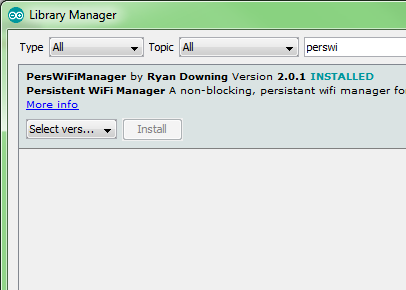

- [Installation](#installation)
	- [Via Arduino IDE Library Manager](#via-arduino-ide-library-manager)
	- [Via ZIP File](#via-zip-file)
- [How to Use](#how-to-use)

# Installation
## Via Arduino IDE Library Manager
**Sketch** -> **Include Library** -> **Manage Libraries...** -> search for "PersWiFiManager"


## Via ZIP File
[Download zip file](https://github.com/r-downing/PersWiFiManager/archive/master.zip) and extract to *Arduino/libraries* folder

# How to Use

The *wifi.htm* can be uploaded to SPIFFS using the [Arduino ESP8266 filesystem uploader](https://github.com/esp8266/arduino-esp8266fs-plugin). Alternatively, the library can be modified to serve the page from PROGMEM instead, by adding the following line to *PersWiFiManager.cpp*

`#define WIFI_HTM_PROGMEM`

For a quick and easy way to serve files from SPIFFS, see my [SPIFFSReadServer](https://github.com/r-downing/SPIFFSReadServer#spiffsreadserver) library.


The PersWiFiManager object should be declared in the same scope as the servers, which are passed as arguments in the constructor.

```cpp
ESP8266WebServer server(80);
DNSServer dnsServer;
PersWiFiManager persWM(server, dnsServer);
```

Then in setup, the `begin()` function should be called.
```cpp
void setup() {

  SPIFFS.begin();
  persWM.begin();
  ...
```

Since the captive DNS server redirects to the root page, the user should make sure their index page or `"/"` handler provides a link to `"/wifi.htm"`

Another option is to have a custom user interface that can make use of the same `"/wifi/..."` server handlers.
